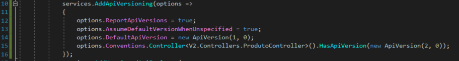
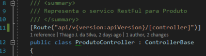
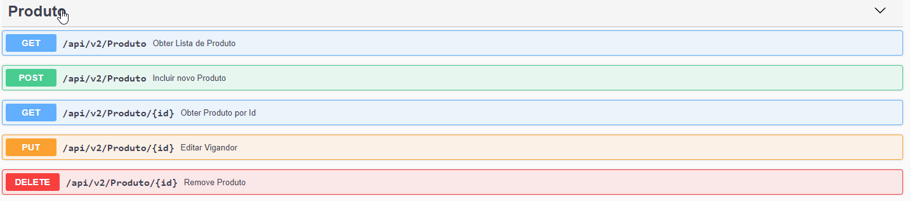
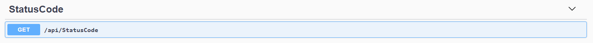

# Versionamento de API

Uma API é um *contrato entre o serviço e o cliente*, e como tal, não deve ser alterada sem notificar o cliente e dar-lhe o prazo necessário para adequação. Não estou dizendo que sua API não possa evoluir livremente, o que estou propondo é que você de ao seu cliente a possibilidade de planejar e realizar a atualização.

Quando precisamos atualizar o contrato de nossa API, e principalmente quando nossa API é de uso publico, normalmente não será possível forçar todos os clientes a atualizarem para o novo contrato da API. Geralmente, é necessário implantar `novas versões` de um serviço de forma incremental, de maneira que versões novas e antigas de um contrato de serviço estejam em execução simultaneamente. Portanto, é importante ter uma estratégia para o controle de versão do serviço.


Quando as alterações na API forem pequenas, como adicionar atributos ou parâmetros à sua API, os clientes que usam uma API mais antiga devem mudar e trabalhar com a nova versão do serviço. Talvez seja possível fornecer valores padrão para quaisquer atributos ausentes que sejam necessários, e os clientes talvez possam ignorar quaisquer atributos de resposta extra.

Sempre que pudermos manter a compatibilidade de nossa API é recomendado, pois quebrar a compatibilidade inclui manter a versão recente e anterior, novos testes, e compatibilidade de todos os cliente. Veja o que [Martin Fowler](https://martinfowler.com/articles/enterpriseREST.html) diz sobre o assunto.
> The problem is that versioning can significantly complicate understanding, testing, and troubleshooting a system. As soon as you have multiple incompatible versions of the same service used by multiple consumers, developers have to maintain bug fixes in all supported versions. If they are maintained in a single codebase, developers risk breaking an old version by adding a new feature to a new version simply because of shared code pathways. If the versions are independently deployed, the operational footprint becomes more complex to monitor and support.

No entanto, às vezes, é necessário fazer alterações importantes e incompatíveis em uma API de serviço. Como talvez não seja possível forçar serviços ou aplicativos cliente a serem atualizados imediatamente para a nova versão, um serviço deve dar suporte a versões mais antigas da API por algum período. Se você estiver usando um mecanismo baseado em HTTP como REST, uma abordagem deverá inserir o número de versão da API na URL ou no cabeçalho HTTP. Em seguida, é possível decidir entre implementar ambas as versões do serviço simultaneamente dentro da mesma instância de serviço ou implantar instâncias diferentes que lidam com uma versão da API. Uma boa abordagem para isso é o [padrão mediador](https:/en.wikipedia.org/wiki/Mediator_pattern) (por exemplo, [biblioteca MediatR](https://github.com/jbogard/MediatR)) para desacoplar as diferentes versões de implementação em manipuladores independentes.


## Configurando o versionamento

Esse projeto tem como abordagem o [versionamento semântico](https://semver.org/). Iremos utilizar o pacote de versionamento muito simples de usar criado pelo time do [ASP.NET Core](https://github.com/microsoft/aspnet-api-versioning). Você precisará instalar o pacote nuget no console do gerenciador de pacotes..

```csharp
Install-Package Microsoft.AspNetCore.Mvc.Versioning
```

No método `ConfigureServices` do seu `startup.cs`, você precisa adicionar os serviços de versionamento de API invocando a extensão `AddApiVersionHandler`

```csharp
public static class ApiVersionAddExtensionHandler
{
    public static IServiceCollection AddApiVersionHandler(this IServiceCollection services)
    {
        services.AddApiVersioning(options =>
        {
            options.ReportApiVersions = true;
            options.AssumeDefaultVersionWhenUnspecified = true;
            options.DefaultApiVersion = new ApiVersion(1, 0);
            options.Conventions.Controller<V2.Controllers.ProdutoController>().HasApiVersion(new ApiVersion(2, 0));
        });
        services.AddVersionedApiExplorer(
            options =>
            {
                options.GroupNameFormat = "'v'VVV";
                options.SubstituteApiVersionInUrl = true;
            });

        return services;
    }
}
```

`ReportApiVersions` é opcional, mas pode ser útil. Ele permite que a API retorne versões em um cabeçalho de resposta. Ao chamar uma API com esse sinalizador, você verá algo como o seguinte.


`AssumeDefaultVersionWhenUnspecified` (bastante interessante) também pode ser útil, especialmente ao migrar uma API para controle de versão. Sem isso, você quebrará todos os clientes existentes que não estejam especificando uma versão da API. Se você está recebendo o erro *Uma versão da API é necessária, mas não foi especificada.*, Este será o motivo.

`DefaultApiVersion` também não é necessário neste caso porque o padrão é 1.0. Mas achei útil incluí-lo como um lembrete de que você pode *atualizar automaticamente* qualquer cliente que não esteja especificando uma versão padrão da API para o mais recente. Há prós e contras para fazer isso, mas a opção está lá, se você quiser.

`GroupNameFormat` define o formato de API que será utilizado. Como está configurado, indica de a versão será: v[MAJOR].[MINOR].[PATCH], veja [Semantic Version](https://semver.org/) para mais informações.

`SubstituteApiVersionInUrl` só é necessário definir essa opção quando o versionamento for por `URL`. Essa opção também é muito interessante quando usamos ferramentadas de documentação como o [OpenAPI Specification](https://github.com/OAI/OpenAPI-Specification)

## Associando Versão usando convenção
Se você tiver muitas versões de API e quizer manter o versionamento e um lugar centralizado para facilitar a manunteção, você pode abrir mão de colocar o atributo `ApiVersion` em todos os controladores e utlizar a configuração descrita no código abaixo.



Como pode ser observado na **linha 15** estamos definido que para o `Controller Produto` do namespace `V2` a versão **2.0**.

Observem abaixo que o `Controller Produto` possuí apenas o atributo de rota e não as especificação de versão.
  


E como pode ser observado na documentação do [Swagger](https://github.com/domaindrivendev/Swashbuckle.AspNetCore), todas as rotas para cada um dos serviços estão com a versão 2.0.



## API Neutra

Em muitos caso possuiamos APIs apenas para manter o status da aplicação, um belo exemplo será o monitoramento de saúda do serviço. Para esse tipo de API não faz muito sentido mantermos o versionamento, já que dificilmente essas APIs sofrerão mudanças que quebre o contrato. 

A forma de implementar a configuração da API Neutra é através do atributo `ApiVersionNeutral`

```csharp
[ApiVersionNeutral]
[Route("api/[controller]")]
public class StatusCodeController : ControllerBase
{
    [HttpGet]
    public IActionResult GetStatusCode() => this.Ok();
}
```

Conforme pode ser observado no trecho de código acima, foi adicionado o atributo `ApiVersionNeutral` e na rota não exite nenhuma informação de versão, logo a url de acesso a esse serviço seria conforme demostrado na image abaixo.



Uma consideração importante. Você deve ter percebido que citamos o termo `Monitoramento de Saúde do Serviço` mas não abordamos o assunto. Como essa assunto é bem amplo e muitíssimo importante, faz sentido criarmos um artigo apenas para ele.

## O uso do atributo ApiVersion

Já foi mencionado diversas vezes o atributo `ApiVersion` inclusive já falamos até como evitar o seu uso, mas agora iremos explicar como utilizado.

Esse atributo é muito simples, possui um parametro `String` onde informamos a versão que será associada a API e o parametro opcional `Deprecated` que quando definido com `True` indicamos a intenção de descontinuar tal API.

Em um controlador podemos ter vários atributos `ApiVersion` indicado que temos no mesmo controlador diferente versão de API. Quando fazemos o uso de varios atributos `ApiVersion` faz se necessário usar o atributo `MapToApiVersion` no método especificio.

Como pode ser observado abaixo cada um dos métodos foi decorado com um atributo `MapToApiVersion`, indicando que cada um deles é responsavel por uma versão especifica da API

```csharp
/// <summary>
/// Representa o servico RestFul para Produto
/// </summary>
[ApiVersion("1.0")]
[ApiVersion("0.9", Deprecated = true)]
[Route("api/v{version:apiVersion}/[controller]")]
public class ProdutoController : ControllerBase
{
    private static readonly List<Produto> Produtos = new List<Produto>()
    {
        new Produto(1, "Tomate", 4.99M, "" ),
        new Produto(2, "Pao France", 12.99M,  ""),
        new Produto(3, "Macarrao Pene", 7.21M , ""),
        new Produto(4, "Oleo Lubrificante", 23.45M, "" )
    };

    /// <summary>
    /// Obter lista de Produtos
    /// </summary>
    [HttpGet]
    [MapToApiVersion("1.0")]
    public ActionResult<IEnumerable<Produto>> ObterProdutos()
    {
        return Produtos.ToList();
    }

    /// <summary>
    /// Obter Produto por Id
    /// </summary>
    /// <param name="id">id de registro do Produto</param>
    [HttpGet("{id}")]
    [MapToApiVersion("0.9")]
    public IActionResult ObterProduto(long id)
    {
        return Ok(Produtos.FirstOrDefault(x => x.Id == id));
    }
}
```

# Conclusão

Embora é recomendado tentar mantermos o máximo possível a compatibilidade do contrato da API, em alguns cenários fica inviavel e para isso que devemos utilizar o versionamento. Com ele conseguimos garantir a continuidade do serviço prestado a nossos cliente e ao mesmo tempo a evolução de nossos serviço.


## Referência

[Swagger](https://github.com/domaindrivendev/Swashbuckle.AspNetCore)  
[Semantic Version](https://semver.org/)  
[Mediator Pattern](https://en.wikipedia.org/wiki/Mediator_pattern)  
[OpenAPI Specification](https://github.com/OAI/OpenAPI-Specification)  
[Microsoft REST API Guidelines](https://github.com/microsoft/api-guidelines/blob/vNext/Guidelines.md)  
[Enterprise Integration Using REST](https://martinfowler.com/articles/enterpriseREST.html)  
[API design: Which version of versioning is right for you?](https://cloud.google.com/blog/products/gcp/api-design-which-version-of-versioning-is-right-for-you)  
[The Web API Checklist -- 43 Things To Think About When Designing, Testing, and Releasing your API](https://mathieu.fenniak.net/the-api-checklist/)
