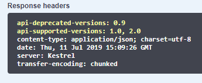

**Em Construção**

# Versionamento de API

Uma API é um *contrato entre o serviço e o cliente*, e como tal, não deve ser alterada sem notificar o cliente e dar-lhe o prazo necessário para adequação. Não estou dizendo que sua API não possa evoluir livremente, o que estou propondo é que você de ao seu cliente a possibilidade de planejar e realizar a atualização.

Quando precisamos atualizar o contrato de nossa API, e principalmente quando nossa API é de uso publico, normalmente não será possível forçar todos os clientes a atualizarem para o novo contrato da API. Geralmente, é necessário implantar `novas versões` de um serviço de forma incremental de maneira que versões novas e antigas de um contrato de serviço estejam em execução simultaneamente. Portanto, é importante ter uma estratégia para o controle de versão do serviço.


Quando as alterações na API forem pequenas, como adicionar atributos ou parâmetros à sua API, os clientes que usam uma API mais antiga devem mudar e trabalhar com a nova versão do serviço. Talvez seja possível fornecer valores padrão para quaisquer atributos ausentes que sejam necessários, e os clientes talvez podem ignorar quaisquer atributos de resposta extra.

Sempre que pudermos manter a mesma versão de nossa API é recomendado, pois alterar a versão inclui manter a versão recente e anterior, novos testes, e compatibilidade de todos os cliente. Veja o que [Martin Fowler](https://martinfowler.com/articles/enterpriseREST.html) diz sobre o assunto.
> The problem is that versioning can significantly complicate understanding, testing, and troubleshooting a system. As soon as you have multiple incompatible versions of the same service used by multiple consumers, developers have to maintain bug fixes in all supported versions. If they are maintained in a single codebase, developers risk breaking an old version by adding a new feature to a new version simply because of shared code pathways. If the versions are independently deployed, the operational footprint becomes more complex to monitor and support.

No entanto, às vezes, é necessário fazer alterações importantes e incompatíveis em uma API de serviço. Como talvez não seja possível forçar serviços ou aplicativos cliente a serem atualizados imediatamente para a nova versão, um serviço deve dar suporte a versões mais antigas da API por algum período. Se você estiver usando um mecanismo baseado em HTTP como REST, uma abordagem deverá inserir o número de versão da API na URL ou no cabeçalho HTTP. Em seguida, é possível decidir entre implementar ambas as versões do serviço simultaneamente dentro da mesma instância de serviço ou implantar instâncias diferentes que lidam com uma versão da API. Uma boa abordagem para isso é o [padrão mediador](https:/en.wikipedia.org/wiki/Mediator_pattern) (por exemplo, [biblioteca MediatR](https://github.com/jbogard/MediatR)) para desacoplar as diferentes versões de implementação em manipuladores independentes.


## Configurando o versionamento

Esse projeto tem como abordagem o [versionamento semântico](https://semver.org/). Iremos utilizar o pacote de versionamento muito simples de usar criado pelo time do [ASP.NET Core](https://github.com/microsoft/aspnet-api-versioning). Você precisará instalar o pacote nuget no console do gerenciador de pacotes..

```csharp
Install-Package Microsoft.AspNetCore.Mvc.Versioning
```

No método `ConfigureServices` do seu `startup.cs`, você precisa adicionar os serviços de versionamento de API invocando a extensão `AddApiVersionHandler`

```csharp
public static IServiceCollection AddApiVersionHandler(this IServiceCollection services)
{
    services.AddApiVersioning(options =>
    {
        options.ReportApiVersions = true;
        options.AssumeDefaultVersionWhenUnspecified = true;
        options.DefaultApiVersion = new ApiVersion(1, 0);
    });
    services.AddVersionedApiExplorer(
        options =>
        {
            options.GroupNameFormat = "'v'VVV";
            options.SubstituteApiVersionInUrl = true;
        });

    return services;
}
```

O sinalizador `ReportApiVersions` é opcional, mas pode ser útil. Ele permite que a API retorne versões em um cabeçalho de resposta. Ao chamar uma API com esse sinalizador, você verá algo como o seguinte.



`AssumeDefaultVersionWhenUnspecified` (bastante interessante) também pode ser útil, especialmente ao migrar uma API para controle de versão. Sem isso, você quebrará todos os clientes existentes que não estejam especificando uma versão da API. Se você está recebendo o erro *Uma versão da API é necessária, mas não foi especificada.*, Este será o motivo.

`DefaultApiVersion` também não é necessário neste caso porque o padrão é 1.0. Mas achei útil incluí-lo como um lembrete de que você pode *atualizar automaticamente* qualquer cliente que não esteja especificando uma versão padrão da API para o mais recente. Há prós e contras para fazer isso, mas a opção está lá, se você quiser.

`GroupNameFormat`

`SubstituteApiVersionInUrl`

## Referência

[Microsoft REST API Guidelines](https://github.com/microsoft/api-guidelines/blob/vNext/Guidelines.md)  
[Mediator Pattern](https:/en.wikipedia.org/wiki/Mediator_pattern)  
[Semantic Version](https://semver.org/)  
[Enterprise Integration Using REST](https://martinfowler.com/articles/enterpriseREST.html)  